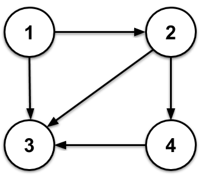

A program to find all the paths for a given graph.  
```js

let allPath = [];
const visited = new Set();
let localPath=[];
const dfs = node => {
  localPath.push(node);
  visited.add(node);
  const allNeighboursVisited=node=>{
    if(adjacencyList.get(node).size==0) return true;
    for (let neighbour of adjacencyList.get(node)) {
      if(!visited.has(neighbour)){
        return false;
      }
    }
    return true;
  }
  if(allNeighboursVisited(node)){
    allPath.push([...localPath]);
    //console.log(JSON.stringify(localPath));
  } 
  else {
  for (let neighbour of adjacencyList.get(node)) {
    if (!visited.has(neighbour)) {
      //localPath.push(neighbour);
      dfs(neighbour);
      localPath.pop();
    }
  }
}
  visited.delete(node);
};
```  
  
```js
//*****Testing1*****

let adjacencyList = new Map();
adjacencyList.set(1, new Set([2,3]));
adjacencyList.set(2, new Set([3,4]));
adjacencyList.set(3, new Set());
adjacencyList.set(4, new Set([3]));
adjacencyList.set(5,new Set());//an isolated node also added for testing

adjacencyList.forEach((v,k)=>{dfs(k);localPath.length=0;});
/*
for (const [k, v] of adjacencyList) {
  dfs(k);
  localPath.length=0;
}
*/
//allPath.length=0;
//dfs(3);
//localPath.length=0;
//dfs(2);

console.log(JSON.stringify(allPath));
allPath.forEach(e=>console.log(JSON.stringify(e)));
```  
  
```js
//*****Testing2*****
allPath.length=0;
visited.clear();
localPath.length=0;
const letter=['A','B','C','D','E','F','G','H'];
adjacencyList = new Map();
adjacencyList.set(0, new Set([1,3,7]));
adjacencyList.set(1, new Set([0,2,3]));
adjacencyList.set(2, new Set([1,3,5]));
adjacencyList.set(3, new Set([0,2,4]));
adjacencyList.set(4, new Set([3,5,7]));
adjacencyList.set(5, new Set([2,4,6]));
adjacencyList.set(6, new Set([5,7]));
adjacencyList.set(7, new Set([0,6]));

adjacencyList.forEach((v,k)=>{dfs(k);localPath.length=0;});
console.log(JSON.stringify(allPath));
newAllPath=allPath.forEach(
  e=>{
    let new_e=e.map(e=>letter[e]);
    console.log(JSON.stringify(new_e));
  });
```
References:
1. [Data Structures in JavaScript: Graphs](https://medium.com/better-programming/basic-interview-data-structures-in-javascript-graphs-3f9118aeb078)  
2. [Print all paths from a given source to a destination
](https://www.geeksforgeeks.org/find-paths-given-source-destination/)  
